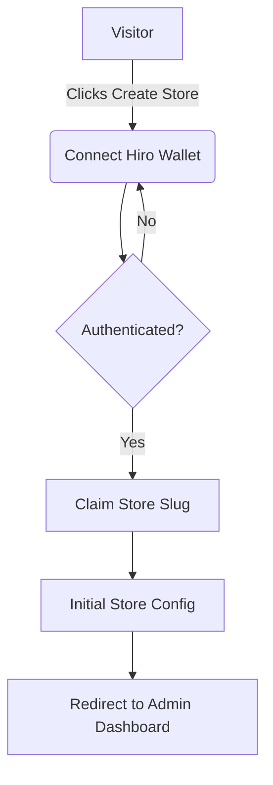
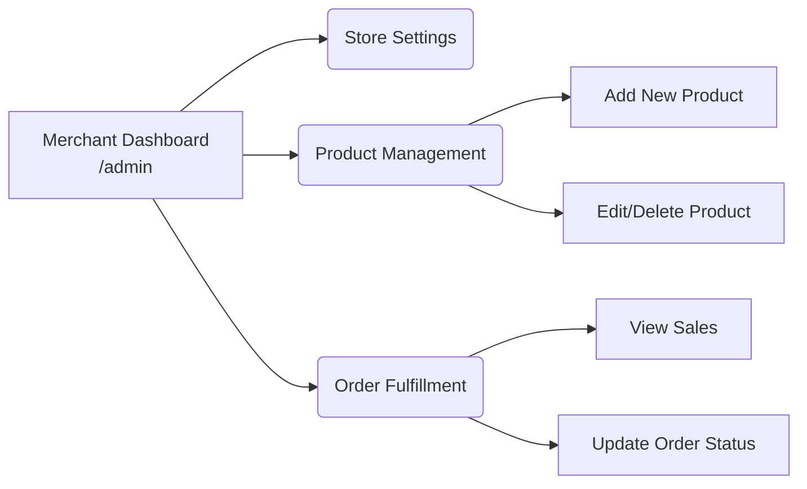
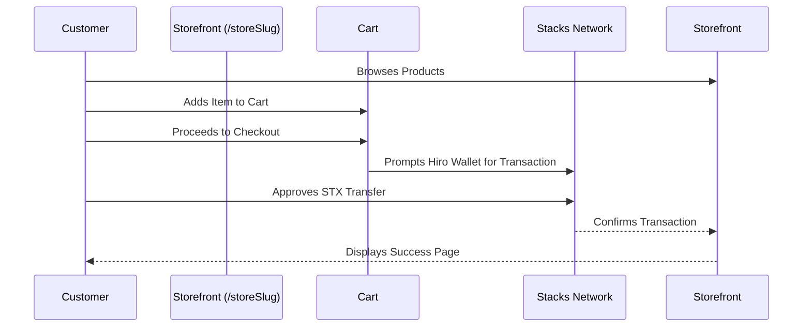

# StackMart 🛒⚡

**A decentralized storefront builder powered by Stacks (Bitcoin L2)**

StackMart is a Web3 e-commerce platform that enables merchants to easily create digital storefronts, manage products, and accept STX payments through the Bitcoin Layer 2 network. Built for creators, developers, and entrepreneurs who want to leverage blockchain technology for secure, decentralized commerce without intermediaries.

**Live Demo:** [https://stacks-mart.vercel.app/](https://stacks-mart.vercel.app/)

## 🌟 Core Offerings & Value Proposition

- **Decentralized Commerce**: Accept STX payments directly, natively secured by Bitcoin.
- **Merchant Dashboard**: Comprehensive admin tools for managing products, monitoring orders, and customizing store settings.
- **Custom Storefronts**: Dedicated, branded public pages for merchants to showcase and sell their digital or physical products.
- **Web3 Authentication**: Seamless and secure sign-in using Hiro Wallet via `@stacks/connect`.
- **Streamlined Onboarding**: Easy setup process for new merchants to configure their identity and launch a store in minutes.

---

## 🏗️ Architecture & Workflows

StackMart is logically divided into three distinct operational domains:

### 1. Merchant Onboarding & Identity
Before creating a storefront, users authenticate with their Stacks wallet and claim a unique store identifier.



### 2. Merchant Admin Dashboard
The secure back-office for authenticated merchants to operate their digital business.



### 3. Customer Storefront & Checkout
The public-facing shopping experience designed for end-users to browse and securely purchase items using STX.



---

## 🗂️ Application Structure & Key Pages

The application utilizes Next.js (App Router) to enforce separation of concerns between public shopping areas and secure merchant areas.

### 🏪 Public Storefront (`app/[storeSlug]`)
The customer-facing side of the platform where buyers interact with merchant stores.
- **`app/[storeSlug]/page.tsx`**: The main public storefront page. Displays the store's branding and lists all available products. Customers can browse items and add them to their shopping cart.
- **`app/[storeSlug]/checkout/page.tsx`**: The Web3 checkout flow where customers review their cart and finalize their purchases by executing a smart contract or direct STX transfer.
- **`app/[storeSlug]/success/page.tsx`**: Order confirmation screen presented post-purchase, displaying the transaction ID and order details.

### 🛡️ Merchant Admin Dashboard (`app/admin`)
The secure backend interface restricted to the store owner.
- **`app/admin/page.tsx`**: The main admin dashboard overview. Provides high-level metrics (e.g., total sales, revenue), recent activity, and quick navigation links.
- **`app/admin/store/products/page.tsx`**: Product management interface. Merchants can create new listings, upload images, manage inventory levels, and set prices denominated in STX.
- **`app/admin/store/orders/page.tsx`**: Order management tracker. Allows merchants to view incoming orders, buyer addresses, and update fulfillment statuses.
- **`app/admin/store/settings/page.tsx`**: Store configuration. Merchants can update their store name, description, branding assets, and notification preferences.

### 🚀 Merchant Onboarding (`app/onboard`)
- **`app/onboard/page.tsx`**: A dedicated onboarding wizard for new merchants. It guides users through connecting their wallet, defining their store's unique URL slug (`[storeSlug]`), and completing the initial setup required to activate their storefront.
- **`app/onboard/AuthFlowClient.tsx`**: Client-side logic handling the intricate states of wallet connection and initial profile creation.

### 🌐 Core & Shared
- **`app/page.tsx`**: The main landing page for StackMart itself, explaining the platform's value proposition to prospective merchants and funneling them towards the onboarding flow.
- **`hooks/`**: Custom React hooks handling business logic (e.g., `useWallet`, `useCart`).
- **`components/ui/`**: Reusable interface components tailored with Tailwind CSS and Lucide React icons.

---

## 🧩 Tech Stack

| Category | Technology |
|----------|------------|
| **Frontend Framework** | Next.js 16 (App Router), React 19 |
| **Styling** | Tailwind CSS 4, Lucide React icons |
| **Web3 / Stacks Integration** | `@stacks/connect`, `@stacks/auth` |
| **State & Flow Management** | `@stepperize/react` |
| **Language** | TypeScript (Strict Mode) |
| **Deployment & Hosting** | Vercel |

---

## 🚀 Getting Started

### Prerequisites
- Node.js 18+ 
- npm, yarn, or pnpm
- [Hiro Wallet](https://wallet.hiro.so/) browser extension installed

### Installation & Setup

1. **Clone the repository**
   ```bash
   git clone <your-repo-url>
   cd stacks-store
   ```

2. **Install dependencies**
   ```bash
   npm install
   ```

3. **Configure Environment Variables**
   ```bash
   cp .env.example .env
   # Edit .env to include your specific network settings (Testnet/Mainnet)
   ```

4. **Run the development server**
   ```bash
   npm run dev
   ```

5. **Launch Application**
   Navigate to [http://localhost:3000](http://localhost:3000)

---

## 🧪 Testing & Verification Walkthrough
1. **Wallet Setup:** Ensure your Hiro Wallet is set to the correct network (e.g., Testnet for development).
2. **Launch Node:** Run `npm run dev`.
3. **Merchant Creation:** Navigate to `/onboard`, connect your wallet, and register a new store slug.
4. **Product Population:** Access the Admin Dashboard at `/admin`, proceed to Products, and add a test item with an STX price.
5. **Customer Simulation:** Open an incognito window, navigate to your public URL (`/your-store-slug`), add the item to your cart, and proceed to checkout using a secondary Hiro Wallet account.

---

## 🤝 Contributing
We welcome community contributions! 
- Follow standard TypeScript best practices.
- Ensure any new Web3 features are thoroughly tested across different wallet states (unauthenticated, wrong network, insufficient funds).
- Submit bug reports or feature requests via GitHub Issues.

## 📄 License
This project is open-source and available under the [MIT License](LICENSE).
